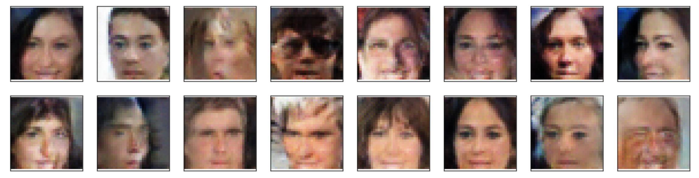

# Project Overview

This project implements human face generator using DCGAN in pytorch as part of my learning journey in the Udacity deep-learning nanodegree program.

The training data is taken from celebrity face dataset [CelebFaces Attributes Dataset (CelebA)](http://mmlab.ie.cuhk.edu.hk/projects/CelebA.html).

## Sample Input

## Sample Output

